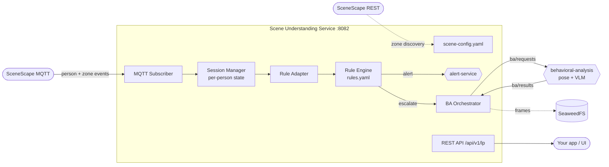

# Scene Understanding Service — Demo Runbook

A one-page guide for demoing the **Scene Understanding Service**: what it is, how
it works, how it integrates with other apps, and the exact steps + talking
points to run a live demo.

---

## 1. What it is

A generic, **config-driven FastAPI microservice** (port `8082`) that turns raw
SceneScape tracking events into *behavioral decisions*.

- **Not hard-coded to loss prevention.** Suspicious-activity detection
  (loitering, checkout bypass, concealment, restricted-zone) is just one
  ruleset.
- All behavior comes from **two YAML files** — it drops into any SceneScape
  deployment with **no code changes**.

---

## 2. How it works



1. **Startup zone discovery** — authenticates to the SceneScape REST API and
   resolves configured zone/scene *names* → UUIDs.
2. **Subscribes** to SceneScape MQTT topics (scene-data, region-event,
   camera-image).
3. **Session manager** keeps a per-person state machine (zone visits, dwell
   time, flags).
4. **Rule engine** evaluates each event against `rules.yaml`, producing two
   action types:
   - `alert` → POSTed to the **alert-service** (deduplicated).
   - `escalate` → invokes a named service (e.g. `behavioral_analysis`), which
     captures frames to **SeaweedFS** and publishes `ba/requests` over MQTT.
5. **Behavioral analysis** (optional) returns a verdict on `ba/results`; the
   service folds it back into the session so later rules can raise severity.
6. **REST API** (`/api/v1/lp/*`) exposes live sessions, zones, and alerts to
   your app.

---

## 3. The two config files (the whole integration surface)

**`scene-config.yaml`** — connection + what to watch:

```yaml
scenescape_api:
  base_url: https://web.scenescape.intel.com
  verify_ssl: false
scenes:
  - scene_name: example-scene
    cameras: [example-camera1]
    zones:
      zone1: HIGH_VALUE
      zone2: CHECKOUT
mqtt:
  host: broker.scenescape.intel.com
  port: 1883
  use_tls: false
# optional: seaweedfs, alert_service blocks
```

**`rules.yaml`** — how events are interpreted (`trigger` + `conditions` +
`actions`, plus `variables`, `session_flags`, `services`).

Identity/credentials come from env vars only:
`STORE_ID`, `SCENESCAPE_API_USER`, `SCENESCAPE_API_PASSWORD`, `ALERT_SERVICE_URL`.

### Environment variables

These are the **only** env vars the service reads directly. Everything else
(MQTT host/port/TLS and the SceneScape API **URL**) lives in
`scene-config.yaml` — only the API *credentials* are env vars.

| Var                       | Default                   | Needed?                        | Purpose                                      |
| ------------------------- | ------------------------- | ------------------------------ | -------------------------------------------- |
| `SCENESCAPE_API_USER`     | _(empty)_                 | **Yes** for zone auto-discovery | SceneScape REST username                     |
| `SCENESCAPE_API_PASSWORD` | _(empty)_                 | **Yes** for zone auto-discovery | SceneScape REST password                     |
| `STORE_ID`                | `store_001`               | Optional                       | Identifier stamped into alert payloads       |
| `CONFIG_DIR`              | `/app/configs`            | Optional                       | Directory holding the two YAML config files  |
| `ALERT_SERVICE_URL`       | from `alert_service` block | Optional                       | Overrides the downstream alert-service URL   |
| `http_proxy` / `https_proxy` / `no_proxy` | _(empty)_ | Optional                       | Proxy passthrough                            |

**For the demo:** only the two `SCENESCAPE_API_*` credentials really matter —
without them, zone auto-discovery is skipped and you'd register zones manually
via `PUT /api/v1/lp/zones/{region_id}`. The rest have safe defaults.

---

## 4. How to integrate with another app

Three integration seams — pick what you need:

| Seam           | Direction              | Mechanism                                       | Notes |
| -------------- | ---------------------- | ----------------------------------------------- | ----- |
| **Input**      | SceneScape → service   | MQTT topics + REST (zone discovery)             | Required. Point `mqtt`/`scenescape_api` at your deployment. |
| **REST API**   | Your app → service     | `GET /api/v1/lp/sessions`, `/zones`, `/alerts`, `/status` | How a UI/dashboard or another microservice consumes results. |
| **Escalation** | service → worker       | MQTT `ba/requests` / `ba/results` + SeaweedFS   | Add the behavioral-analysis worker on the same Docker network. Pure MQTT — no URL wiring. |
| **Alerts**     | service → alert-service| HTTP POST to `ALERT_SERVICE_URL`                | Your app reads alerts via the `/alerts` proxy or directly from alert-service. |

**Key point:** another app integrates either by **reading the REST API**
(`/api/v1/lp/*`) or by **subscribing to the same alert-service / MQTT stream**.
On a shared Docker network, services resolve each other by container name — just
drop the container into your compose stack.

---

## 5. Demo steps

**Prereq:** a reachable SceneScape deployment (MQTT broker + REST API). The
service has *no hard startup dependency* — it retries MQTT in the background.

### Option A — Fastest demo (standalone container)

```bash
cd edge-ai-libraries/microservices/scene-understanding-service

# 1. Edit configs/scene-config.yaml → point mqtt + scenescape_api at your SceneScape
# 2. Build + run
docker build -t intel/scene-understanding-service:latest .
docker run -p 8082:8082 \
  -e STORE_ID=demo_store \
  -e SCENESCAPE_API_USER=admin \
  -e SCENESCAPE_API_PASSWORD=<pass> \
  -v ./configs:/app/configs:ro \
  intel/scene-understanding-service:latest
```

### Option B — Bundled compose (service only)

```bash
cd edge-ai-libraries/microservices/scene-understanding-service
docker compose up -d
docker compose logs -f scene-understanding-service
```

### Option C — Full integration stack (SeaweedFS + BA + alert-service + UI)

```bash
cd storewide-loss-prevention/suspicious-activity-detection
make up        # scene-understanding-service:8082 + Gradio UI :7860 + full stack
```

---

## 6. Verify + drive the demo

```bash
# Health
curl --noproxy '*' http://127.0.0.1:8082/health
# → {"status":"healthy"}

# Readiness + runtime stats (active sessions, resolved zones, MQTT state)
curl --noproxy '*' http://127.0.0.1:8082/api/v1/lp/status

# Live person sessions (walk someone through a zone on camera → shows up here)
curl --noproxy '*' http://127.0.0.1:8082/api/v1/lp/sessions

# Resolved zones (proves auto-discovery worked)
curl --noproxy '*' http://127.0.0.1:8082/api/v1/lp/zones

# Alerts raised by rules (loiter / bypass / concealment)
curl --noproxy '*' http://127.0.0.1:8082/api/v1/lp/alerts
```

---

## 7. Demo narrative (talking points)

1. Show `GET /status` → service connected, zones resolved from SceneScape.
2. Have a person enter a `HIGH_VALUE` zone on camera.
3. `GET /sessions` → the tracked person appears with dwell time + zone visits.
4. Trigger a rule (e.g. loiter, or shelf-to-waist concealment).
5. `GET /alerts` → the alert shows up (deduplicated per session/zone).
6. *(If behavioral-analysis is wired)* the `escalate` action captures frames to
   SeaweedFS and a **VLM confirms** concealment on `ba/results`, raising
   severity.

**One-liner:** *"Same engine, different `rules.yaml` — it reads scene events and
produces alerts for any behavioral scenario, loss prevention being just one."*

---

## 8. Reference

- API base: `http://127.0.0.1:8082`, prefix `/api/v1/lp`.
- Config dir: `/app/configs` (override with `CONFIG_DIR`); mount `./configs` to
  override the bundled samples.
- Readiness gating for `depends_on`: use `GET /api/v1/lp/status` or `GET /health`.
- Behavioral-analysis patterns: `behavioral-analysis/config/patterns.yaml`
  (pose rules + VLM prompts, e.g. `shelf_to_waist`, `loitering`).
