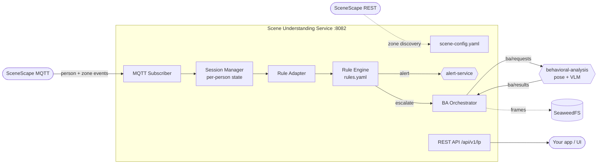

# Scene Understanding Service — Demo Runbook

A one-page guide for demoing the **Scene Understanding Service**: what it is, how
it works, how it integrates with other apps, and the exact steps + talking
points to run a live demo.

---

## 1. What it is

A generic, **config-driven FastAPI microservice** (port `8082`) that turns raw
SceneScape tracking events into *behavioral decisions*.

- **Not hard-coded to loss prevention.** Suspicious-activity detection
  (loitering, checkout bypass, concealment, restricted-zone) is just one
  ruleset.
- All behavior comes from **two YAML files** — it drops into any SceneScape
  deployment with **no code changes**.

---

## 2. How it works



1. **Startup zone discovery** — authenticates to the SceneScape REST API and
   resolves configured zone/scene *names* → UUIDs.
2. **Subscribes** to SceneScape MQTT topics (scene-data, region-event,
   camera-image).
3. **Session manager** keeps a per-person state machine (zone visits, dwell
   time, flags).
4. **Rule engine** evaluates each event against `rules.yaml`, producing two
   action types:
   - `alert` → POSTed to the **alert-service** (deduplicated).
   - `escalate` → invokes a named service (e.g. `behavioral_analysis`), which
     captures frames to **SeaweedFS** and publishes `ba/requests` over MQTT.
5. **Behavioral analysis** (optional) returns a verdict on `ba/results`; the
   service folds it back into the session so later rules can raise severity.
6. **REST API** (`/api/v1/lp/*`) exposes live sessions, zones, and alerts to
   your app.

---

## 2a. Session Manager — how it works internally

The **Session Manager** (`services/session_manager.py`) owns the live state of
every person in the scene. It is the stateful core that turns noisy, flickering
SceneScape tracks into stable per-person sessions and clean domain events
(`ENTERED`, `EXITED`, `LOITER`, `PERSON_LOST`) that the rule engine consumes.

### The three MQTT feeds it consumes

| Feed          | Topic pattern                       | Role |
| ------------- | ----------------------------------- | ---- |
| **scene-data**   | `scenescape/data/scene/+/+`      | Position/visibility updates — keeps sessions **alive** (`last_seen`, cameras, bbox). Does *not* fire enter/exit. |
| **region-event** | `scenescape/event/region/+/+/+`  | SceneScape's native **ENTERED / EXITED** lists with authoritative dwell time. Drives zone-visit open/close. |
| **region-data**  | `scenescape/data/region/+/+`     | Continuous per-frame presence with running `dwell` — drives the real-time **LOITER** event. |

### Session identity: canonical-ID aliasing (the tricky part)

SceneScape often assigns a **fresh UUID to the same physical person every few
seconds**; each new track lists its ancestors in `previous_ids_chain`. If the
service treated each UUID as a new person, dwell time, frame folders, and dedup
would all fragment.

To prevent this, every incoming track is routed through
`_resolve_canonical(scene_id, oid, prev_chain)`:

1. If the raw `oid` already has an alias → return the stored **canonical** id.
2. Otherwise walk `previous_ids_chain`; if any ancestor is known, alias this
   `oid` onto that ancestor's canonical id.
3. Check **tombstones** (recently expired canonicals, kept for a 5-minute grace
   window) — if a person reappears after their session expired, the new UUID
   re-inherits the old canonical id instead of starting fresh.
4. If nothing matches, the `oid` becomes its own root canonical.

Sessions are keyed by `(scene_id, canonical_object_id)`, so all downstream state
(sessions, BA frame folders, alert dedup) stays unified across re-id flicker and
across multiple scenes.

### State machine per person (`PersonSession`)

Each session tracks: `first_seen` / `last_seen`, `current_cameras` +
`camera_history`, `bbox`, `reid_state`, open/closed `region_visits`,
`current_zones` (zone → entry timestamp), `zone_visit_counts`, and per-zone
flags like `loiter_alerted`.

### Event flow inside the manager

- **`on_scene_data`** — filters to configured scenes/cameras and person objects,
  resolves the canonical id, then either **updates** liveness on an existing
  session or **creates** a new one. Promotes `reid_state` to `matched` and fires
  registered *match handlers* when SceneScape confirms identity.
- **`on_region_event`** — for each `entered`, opens a `RegionVisit` (anchored on
  SceneScape's authoritative per-region `entered` timestamp — this becomes the
  BA frame-bucket folder name) and fires `ENTERED`; duplicate entries while
  already in-zone are suppressed. For each `exited`, closes the visit using
  SceneScape's native `dwell` and fires `EXITED`.
- **`on_region_data`** — only for `HIGH_VALUE` zones; reads SceneScape's running
  `dwell` each frame and emits a `LOITER` event. The **rule engine** decides
  whether to actually alert (`dwell_seconds > threshold`); per-visit dedup is
  handled via the session's `loiter_alerted` flag.

### Session expiry loop

A background loop (`run_expiry_loop`) runs every 5 s:

- Sessions whose `last_seen` is older than `session_timeout_seconds` (default
  30s, from `rules.yaml`) are expired: all open visits are closed with `EXITED`
  events, a `PERSON_LOST` event is fired, and the session is removed.
- **MQTT-down guard:** if the broker is disconnected, expiry is *paused* —
  otherwise a transient hiccup would stale every `last_seen` and wipe all
  tracking at once.
- Expired canonical ids become **tombstones** for a 5-minute grace window (see
  aliasing above), then are purged.

> **Demo tip:** `GET /api/v1/lp/sessions` reflects this live state. By default it
> hides `pending_collection` tracks (re-id not yet settled) — pass
> `?include_pending=true` to see transient tracks appear/merge as SceneScape
> re-identifies a person.

---

## 2b. Each component — internal working

The service is wired together in `main.py` (FastAPI `lifespan`): it loads config,
authenticates to SceneScape and discovers zones, then constructs every component
below and registers their MQTT/event handlers before serving the API.

### `services/config.py` — ConfigService

- Loads the single `scene-config.yaml` from `CONFIG_DIR` (`/app/configs`), with a
  dev fallback to `../configs`. Also loads the `rules.yaml` settings block.
- Exposes typed accessors used everywhere: MQTT host/port/TLS, SceneScape API
  URLs, scenes/cameras, zone name↔type maps, session-flag defs, rule settings.
- **Zone registry** — holds the runtime region-UUID → zone-type map; zone
  discovery (`merge_zones`) and the `PUT/DELETE /zones` API mutate it live.
- **Stream density** — can fan a single scene template out into N scene copies
  (`expand_scene_configs`) for load/perf testing without editing config by hand.
- Thread-safe (guarded by a lock) since MQTT threads and the API both read it.

### `services/scenescape_client.py` — SceneScapeClient

- Thin async REST client (`aiohttp`) for SceneScape. Token-authenticates
  (`authenticate`) and caches the token.
- On startup it **resolves scene names → scene UUIDs** and **fetches regions**,
  then `map_zones()` matches each region's *name* to the zone types declared in
  `scene-config.yaml` — this is the auto-discovery that populates the zone
  registry. `verify_ssl:false` is honored for self-signed SceneScape certs.

### `services/mqtt_service.py` — MQTTService

- Wraps `paho-mqtt`; connects to the SceneScape broker (optional TLS/CA cert,
  username/password) and **auto-reconnects** in the background.
- Subscribes and **regex-routes** four topic shapes to registered handlers:
  - `scenescape/data/scene/{scene}/{type}` → `SessionManager.on_scene_data`
  - `scenescape/data/region/{scene}/{region}` → `on_region_data`
  - `scenescape/event/region/{scene}/{region}/{suffix}` → `on_region_event`
  - `scenescape/image/camera/{camera}` → `FrameCaptureService`
- Exposes a `connected` flag (used by the session-expiry pause guard) and a
  `publish()` / `publish_raw()` used for `getimage` commands and `ba/requests`.

### `services/session_manager.py` — SessionManager

See **§2a** above — the stateful per-person core (canonical-ID aliasing, visit
tracking, LOITER emission, expiry loop).

### `rule_engine/` — RuleEngine (generic, self-contained)

- A **standalone YAML evaluator** with *zero imports from the parent service* —
  the whole package can be lifted into its own microservice.
- `evaluate(context)` runs each rule's `trigger` + `conditions` against a flat
  context dict and returns a list of `Action` objects (`alert` / `escalate`).
  It has **no side effects** — the adapter decides how to act.
- Supports comparison operators (`eq/ne/gt/gte/lt/lte`), `${var:default}`
  variable substitution, and dynamic key refs like `zone_visit_counts[region_id]`.

### `services/rule_adapter.py` — RuleEngineAdapter

- The **bridge** between the generic engine and this service's domain.
- Translates each `RegionEvent` + `PersonSession` into the flat context dict the
  engine expects, calls `engine.evaluate()`, then maps returned `Action`s back
  into domain effects:
  - `alert` → builds an `Alert` and hands it to `AlertServiceClient` (with
    per-session/zone **dedup**, e.g. `loiter_alerted`).
  - `escalate` → starts/stops the named `EscalationService` (behavioral
    analysis) for that `(person, region)`.
- Owns **session-flag transitions** (config-driven, e.g. `visited_high_value`),
  the loiter threshold gate, and post-visit frame cleanup.

### `services/ba_orchestrator.py` — BehavioralAnalysisOrchestrator

- Owns the **per-visit BA cadence**. On `escalate.start(person, region, scene)`
  it launches one asyncio task per HIGH_VALUE visit that repeats a
  *frame-capture cycle*:
  1. emit `frame_capture_count` `getimage` commands spread across
     `frame_capture_interval_seconds` (replies land in the `behavioral-frames`
     bucket via FrameCaptureService),
  2. publish **one** `ba/requests` message so BA runs a single-shot pose+VLM pass
     over the accumulated frames.
- Stops cleanly on `stop()` (SceneScape `EXITED`) or `stop_all()` (`PERSON_LOST`).
- BA itself is **stateless** — each request makes BA fetch the latest K frames
  and analyze once.

### `services/ba_queue.py` — BAQueuePublisher / BAQueueConsumer

- Thin MQTT queue over the existing broker connection.
- **Publisher** emits `ba/requests` (`person_id`, `region_id`, `entry_timestamp`,
  `scene_id`, `last_frame_ts`) — the frame-folder anchor lets BA locate the right
  SeaweedFS prefix.
- **Consumer** subscribes to `ba/results` and folds the verdict back into the
  session (setting flags a later `alert` rule can escalate severity on).

### `services/frame_capture.py` — FrameCaptureService (+ CapturedFrameTracker)

- Consumes `scenescape/image/camera/{camera}` frames, decides which active
  HIGH_VALUE session(s) a frame belongs to, and stores it via `FrameManager`.
- `CapturedFrameTracker` shares per-`(scene,person,region)` state with the
  orchestrator: the **latest** stored timestamp (published as `last_frame_ts`)
  and a per-cycle **quota** (`_remaining`) so no more than `frame_capture_count`
  frames are stored per cycle even if extra images arrive.
- Does **not** publish `ba/requests` — that's the orchestrator's job.

### `services/frame_manager.py` — FrameManager

- S3/MinIO client for **SeaweedFS**. Stores evidence frames only for persons
  currently in HIGH_VALUE zones.
- Bucket layout: `loss-prevention-frames/{object_id}/{timestamp}.jpg` as a
  **rolling buffer** (~20 frames/person, ~2 fps), plus
  `alerts/{alert_id}/evidence/` for frames retained for audit.
- No-ops gracefully if the `minio` package/endpoint is unavailable.

### `services/alert_service_client.py` — AlertServiceClient

- Async HTTP client (`aiohttp`) that POSTs `Alert` objects to the external
  **alert-service** (`ALERT_SERVICE_URL`), which owns delivery (MQTT/webhook/log),
  schema validation, dedup, severity, and history.
- **Fails soft**: when the alert-service is down or disabled, alerting degrades
  gracefully instead of breaking the pipeline.

### `api/routes.py` — REST API (`/api/v1/lp`)

- FastAPI router exposing read access to the live state built above: `/status`,
  `/sessions[/count|/{id}]`, `/zones[...]`, `/alerts[/count]`.
- `/zones/discover` re-runs SceneScape discovery; `PUT/DELETE /zones/{id}` mutate
  the registry at runtime; `/alerts` proxies the alert-service.

---

## 3. The two config files (the whole integration surface)

**`scene-config.yaml`** — connection + what to watch:

```yaml
scenescape_api:
  base_url: https://web.scenescape.intel.com
  verify_ssl: false
scenes:
  - scene_name: example-scene
    cameras: [example-camera1]
    zones:
      zone1: HIGH_VALUE
      zone2: CHECKOUT
mqtt:
  host: broker.scenescape.intel.com
  port: 1883
  use_tls: false
# optional: seaweedfs, alert_service blocks
```

**`rules.yaml`** — how events are interpreted (`trigger` + `conditions` +
`actions`, plus `variables`, `session_flags`, `services`).

Identity/credentials come from env vars only:
`STORE_ID`, `SCENESCAPE_API_USER`, `SCENESCAPE_API_PASSWORD`, `ALERT_SERVICE_URL`.

### Environment variables

These are the **only** env vars the service reads directly. Everything else
(MQTT host/port/TLS and the SceneScape API **URL**) lives in
`scene-config.yaml` — only the API *credentials* are env vars.

| Var                       | Default                   | Needed?                        | Purpose                                      |
| ------------------------- | ------------------------- | ------------------------------ | -------------------------------------------- |
| `SCENESCAPE_API_USER`     | _(empty)_                 | **Yes** for zone auto-discovery | SceneScape REST username                     |
| `SCENESCAPE_API_PASSWORD` | _(empty)_                 | **Yes** for zone auto-discovery | SceneScape REST password                     |
| `STORE_ID`                | `store_001`               | Optional                       | Identifier stamped into alert payloads       |
| `CONFIG_DIR`              | `/app/configs`            | Optional                       | Directory holding the two YAML config files  |
| `ALERT_SERVICE_URL`       | from `alert_service` block | Optional                       | Overrides the downstream alert-service URL   |
| `http_proxy` / `https_proxy` / `no_proxy` | _(empty)_ | Optional                       | Proxy passthrough                            |

**For the demo:** only the two `SCENESCAPE_API_*` credentials really matter —
without them, zone auto-discovery is skipped and you'd register zones manually
via `PUT /api/v1/lp/zones/{region_id}`. The rest have safe defaults.

---

## 4. How to integrate with another app

Three integration seams — pick what you need:

| Seam           | Direction              | Mechanism                                       | Notes |
| -------------- | ---------------------- | ----------------------------------------------- | ----- |
| **Input**      | SceneScape → service   | MQTT topics + REST (zone discovery)             | Required. Point `mqtt`/`scenescape_api` at your deployment. |
| **REST API**   | Your app → service     | `GET /api/v1/lp/sessions`, `/zones`, `/alerts`, `/status` | How a UI/dashboard or another microservice consumes results. |
| **Escalation** | service → worker       | MQTT `ba/requests` / `ba/results` + SeaweedFS   | Add the behavioral-analysis worker on the same Docker network. Pure MQTT — no URL wiring. |
| **Alerts**     | service → alert-service| HTTP POST to `ALERT_SERVICE_URL`                | Your app reads alerts via the `/alerts` proxy or directly from alert-service. |

**Key point:** another app integrates either by **reading the REST API**
(`/api/v1/lp/*`) or by **subscribing to the same alert-service / MQTT stream**.
On a shared Docker network, services resolve each other by container name — just
drop the container into your compose stack.

---
